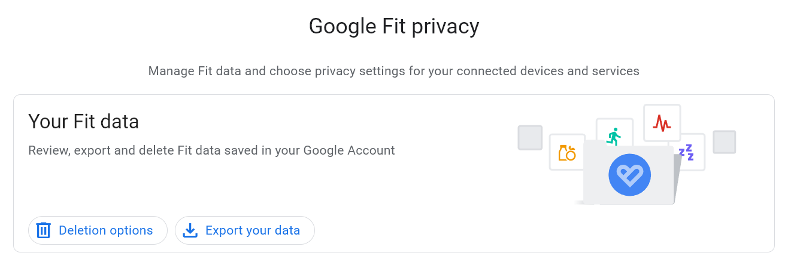
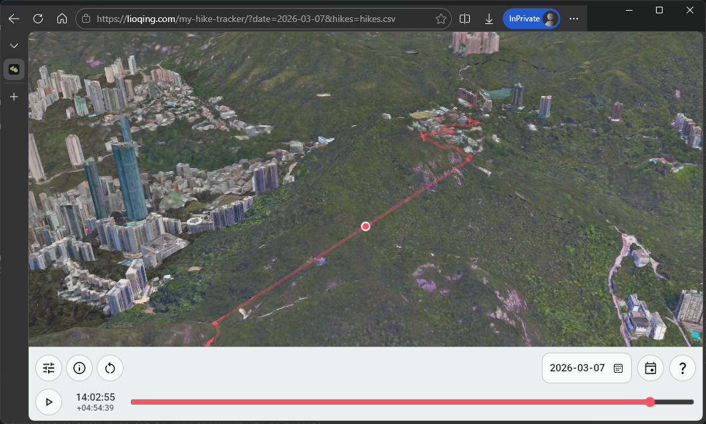
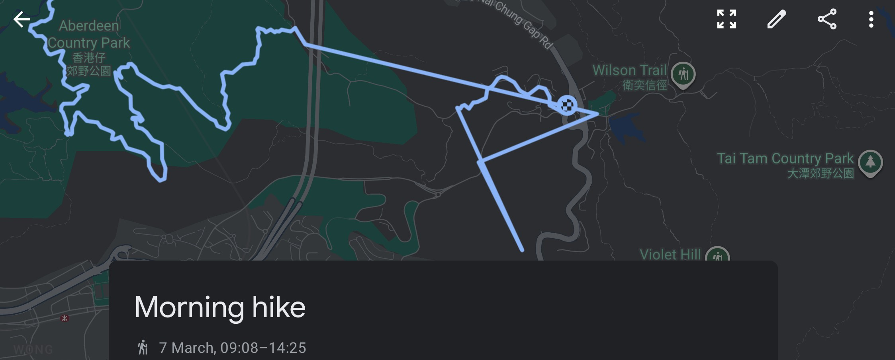
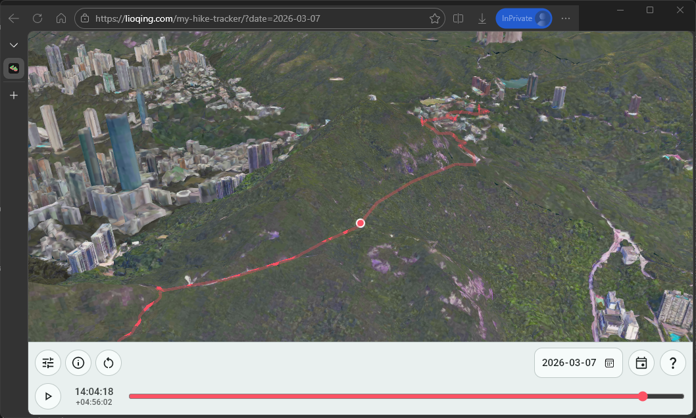
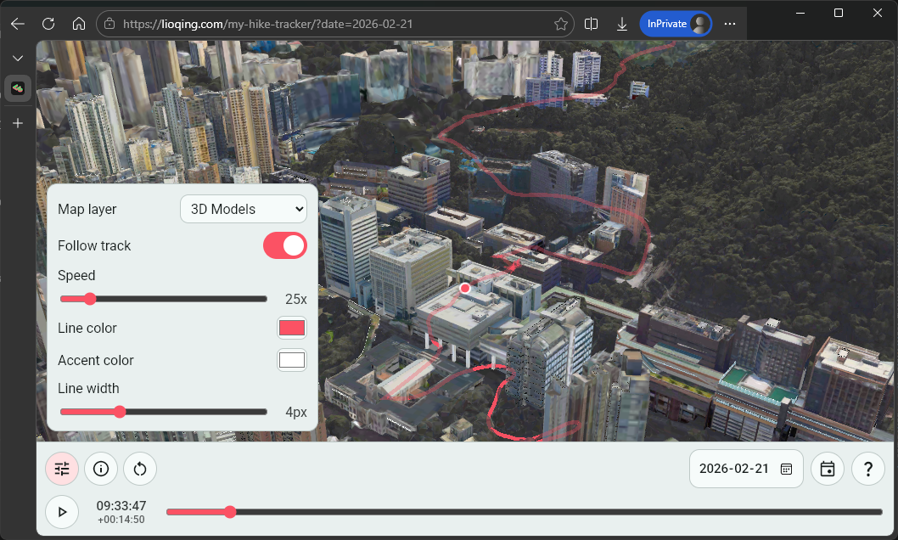
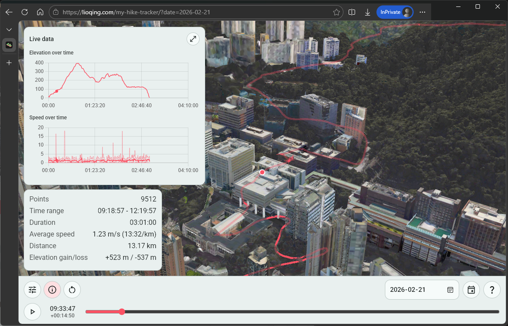
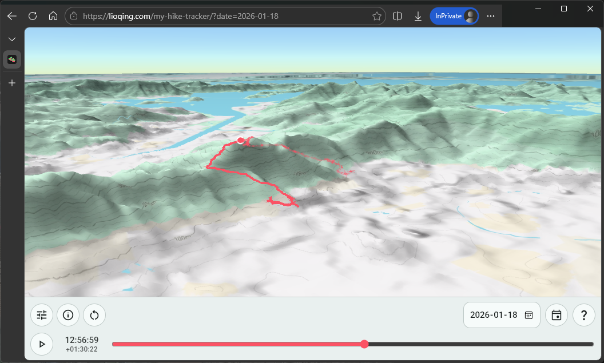
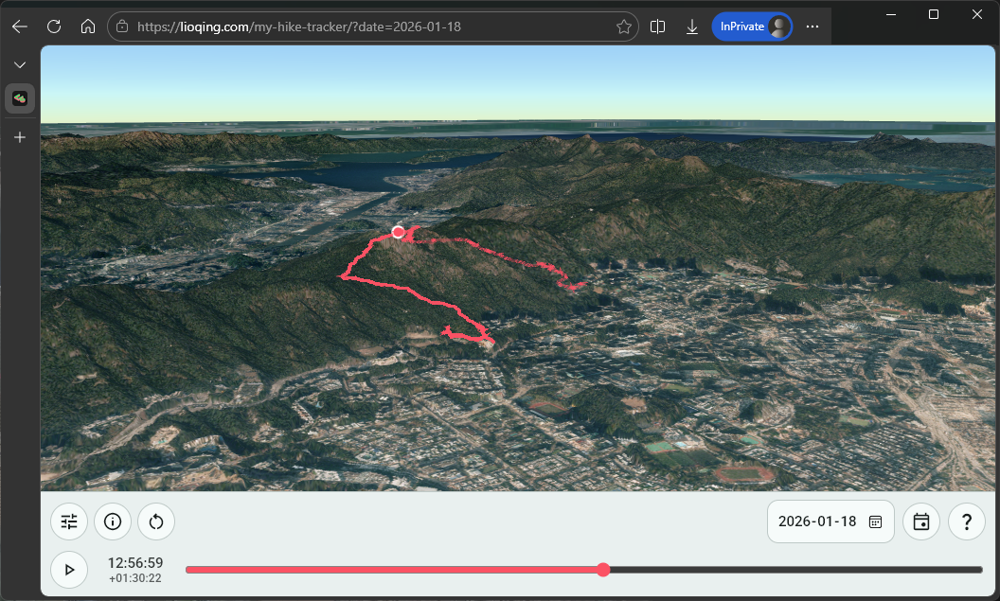
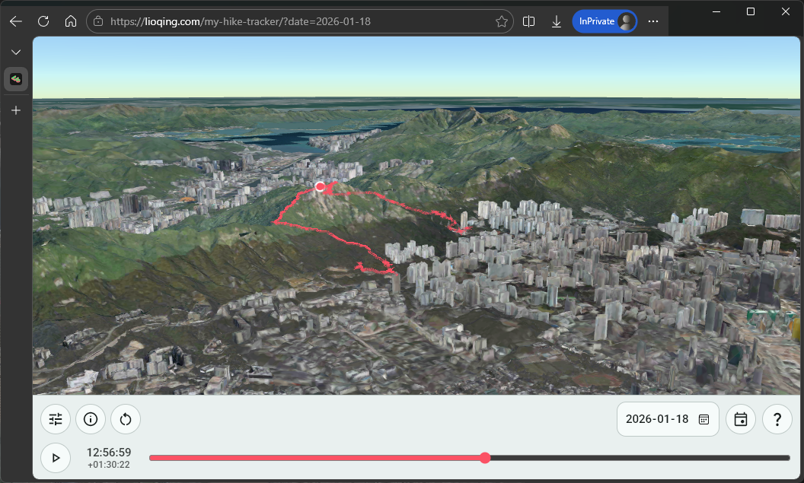

# How I Vibe Coded a Hiking Track Viewer

2026-03-24

---

I recently decided to try out full-on vibe coding on a personal project where I want a visualization of my weekly hikes. For years, I've been hiking around where I live every weekend as a way to refresh myself from the repetitive day jobs, and I have been tracking it with [Google Fit](https://www.google.com/fit/).

One day, I found out that I can export and download the data using [Google Takeout](https://takeout.google.com/), and so I had the idea to make a map viewer that displays my hiking tracks over time.

However, since I am now a full-time software engineer, I don't really want to spend that much time on coding all day, especially for a personal project like this. That's when I decided I will finally try letting LLMs to code everything for me.

> [!NOTE]
>
> Since this is a rather small project, I did not use any advanced LLM prompting techniques like tuning instructions or skills.
>
> I also did not do everything in one session, I intentionally broke the conversations into different sections for specific reason explained later and for avoiding overflowing the context window.

And it did work out for me, it only took me around 3 evenings prompting [GitHub Copilot Pro](https://github.com/github-copilot/pro). I am pretty satisfied with the result, you can visit it at [https://lioqing.com/my-hike-tracker/](https://lioqing.com/my-hike-tracker/).

**Insert video of the website**

In the process, I applied a lot of ideas that I gained from previously coding with LLMs, but I also learnt something new about 
letting AI code an entire project. I'll share them one by one in the following sections.

## Data Source

Before talking about the website, I'd like to talk about where it all started. It all started with where I have my hiking track data.

I hike with Google Fit tracking my progress on my phone every weekend. While the UI of Google Fit is fine and does display useful information, I want to have a more personalized view of my progress.

### Where to download the data

That is why when I found out I can [download the Google Fit data from Google Takeout](https://takeout.google.com/takeout/custom/fit), I decided to make an app or website to display it in a cooler way.


*Google Fit privacy page where user can export their fit data.*

One unfortunate thing is that there is no option to choose a date range or activity type to download your fitness data, so for me, each time I download the data, I am downloading all my activities including hikes, walks, cyclings, etc. since I started using Google Fit in 2018.

### The file format

Before I even start looking at the data, I asked Gemini (my choice of LLM for generic questions) how to extract timestamps and positions from the Google Fit data. This is when I learnt about the [Training Center XML (TCX)](https://en.wikipedia.org/wiki/Training_Center_XML) file format.

It is a file format designed specifically for tracking exercises by Garmin in 2007. It is basically just an XML file with standardized entries.

With it being an established format, can now more confidently let codign agents to help me handle the technical details.

## The Programming Languages and The (Lack of) Framework

I think this project is a pretty typical small-scale personal project for me, great for showing how I decide what tools to use for the tasks.

### The languages

When it comes to these small personal projects, I have already established a simple rule of choosing what language to use and collaborate with coding agents:

- For simple tasks, use established and popular languages.
  - Obviously the choice for building a website is just JavaScript.
- For complex tasks (which I may have to chime in and make changes myself instead of handing off everything to the agent), use languages I am familiar with.
  - For the data extraction and cleaning, I chose Rust, where I want to make sure the ingested data for the website is correct.
  - Most of the time, it is just Rust.

### The vanilla web development experience

You may think that using a framework like [React](https://react.dev/) would be a great fit for it (which I also have experience in), but honestly I have almost never considered using React and instead just do vanilla HTML + CSS + JS because of the following reasons:

- LLMs have been trained on plenty of code examples for vanilla HTML + CSS + JS given that [web standards](https://www.w3.org/standards/) are relatively stable compared to flashy frameworks.
- It is easy to deploy to GitHub Pages where I host all of my website frontends.
- Setting up a project and compiling/building my code is pretty time consuming.
- I just don't like how state is managed in most frameworks.

Unless I absolutely want certain features or libraries from the ecosystem of the framework (especially for the beautiful animations and asthetics), I would prefer to [just f**king use HTML](https://justfuckingusehtml.com/).

## The Collaboration with GitHub Copilot for Handling the Data in Rust

After brief consulting with Gemini to confirm the feasibility of reconstructing my hiking tracks using the Google Fit data, I decided to dive straight into building it.

After all, the only way to start something is to just do it.

### Ingesting the data

At first, I searched up a crate for deserializing tcx format - [tcx](https://crates.io/crates/tcx), and told copilot to start with that. Copilot tried using that crate to deserialize my file.

However, I got the following result when trying to parse one of my hiking TCX files.

```
ParseIntError: invalid digit found in string
```

I suspect this is due to the crate being updated over 4 years ago, which means it is probably outdated if the TCX format has been updated or Google Fit uses a custom TCX format.

So I had to find another solution.

I went ahead and took a look at the dependencies of the tcx crate, I found that it just uses [serde](https://crates.io/crates/serde) with some XML serde deserializer crate. I decided to give copilot a try on just writing a custom TCX deserializer by using serde and whatever XML serde deserializer it wants to use.

After a couple of prompts (to let copilot know that it can test using my TCX file and to further specify the format I want), I was able to extract the timestamp, latitude, and longitude from each hike!

```
=== C:\Users\s2010\Downloads\takeout-20260221T061429Z-3-001\Takeout\Fit\Activities\2026-02-08T07_43_23.438+08_00_PT1H19M30.202S_Hiking.tcx ===    
  1770507805634 -> 22.283260345458984,114.13562774658203
  1770507806472 -> 22.283279418945313,114.13563537597656
  1770507807250 -> 22.283302307128906,114.1356430053711
  ...
```

After successfully extracting the timestamp, latitude, and longitude, I just need to write it to a file for the website to consume. I decided to use CSV as it should be the most straightforward solution.

And it is indeed the most straightforward solution, I opened a new chat session and copilot was able to get it done in just one prompt. I simply told it to write the result to a headerless CSV file with the columns being the timestamp in UNIX seconds, and latitude and longitude in high precision.

After that, I just told copilot to do some chores like refactoring into functions and adding CLI arguments using [clap](https://crates.io/crates/clap).

Additionally, I did some documentations myself for the CLI arguments to keep my future self in context in case I want to further develop or reference the code in future.

### Cleaning the data

While I added the cleaner at almost the end of the project, I want to group it to this section because the process was similar to extracting the data.

When I was checking out my hiking tracks in the website, I realized that sometimes due to me forgetting to complete the tracking in Google Fit app, my positions when I was on railway would get recorded. It makes me look like I am flying across the city.

<video controls>
  <source src="me-flying-across-the-city.mp4" type="video/mp4">
</video>
<i>Me flying across the city.</i>

So I created another Rust project for removing unwanted data points using boolean expression filter rules.

I looked up expression evaluation crates, and found [evalexpr](https://docs.rs/evalexpr/latest/evalexpr/). It was exactly what I wanted, it can evaluate to boolean, substitude variables, and even uses comments to document my filter rules.

The implementation process was very straightforward as well, the chat session only took me 2 prompts. First one for telling copilot to use the evalexpr crate to let user use the extracted data with their corresponding column names in a single column CSV file to filter data points from the extracted data. Second one for telling copilot to remove the header (for some reason it decided to add one named 'expression').

And the result is the following expected format.

```
!(timestamp > 1767456000000 && timestamp < 1767495660000) // 2026-01-04 before 11:01: tracking bugged at the start
!(timestamp > 1769925420000 && timestamp < 1769961600000) // 2026-02-01 after 13:57: forgot to turn off tracking in MTR
```


*Track with missing data.*

It certainly makes the visualization a lot more unpleasant to watch, so I had to find a solution.

While Google Fit itself uses some kind of weird algorithm to try to estimate the missing positions in between, the result is... kind of inaccurate (It is very inaccurate to be honest).

After making sure everything behaves exactly as I expect, I did the same thing as the extractor project. Manually did some documentation and told copilot to refactor some functions into different modules.


*Google Fit with missing data.*

So at the end I decided to just let copilot to implement a manual solution - let the user enter the timestamp during extraction with a `supp.csv` optional file in the following format:

```
2026-03-07 11:40:00,22.257119218707395,114.16070126817006
2026-03-07 11:41:00,22.25710742147126,114.16132644010563
2026-03-07 11:42:00,22.257874943823307,114.16142850051098
...
```

And the result looks good enough in my opinion.


*Track with supp data.*

Lastly, I told copilot to clean all these up by making the program takes CLI arguments using the [Clap](https://crates.io/crates/clap) crate, which I am very familiar with. I made some minor adjustment after copilot's edit and told copilot to break up the one big main file into small modules.

## Letting GitHub Copilot to just be the Pilot in HTML, JS, and CSS

Getting the visualization in was the biggest uncertainty about this project as I didn't know the best way to make a map viewer. Fortunately, I found out [CesiumJS](https://cesium.com/platform/cesiumjs/) later which saved my a lot of work.

### The Failed Early Attempt at a 2D LOD Map Rendering

I attempted to screenshot Google Map in different resolution and then render them individually in the beginning. I was surprised to find that copilot was able to do it very quickly, and it looked like it worked perfectly at first. But then I found out it doesn't work on less powerful devices like laptops and phones.

<video controls>
  <source src="2d-lod-map-with-issues-in-phone.webm" type="video/webm">
</video>
<i>2D LOD map with issues in phone.</i>

The issue was most likely the many LOD chunks. I was using 4K images per chunk and hoping it would work, but apparently some devices are just not powerful enough to render multiple 4K images at certain zoom level...

The whole point of putting a viewer like this on the website is so that I can view it anywhere, which is also the reason I got into web development. (I am not a big fan of the current mainstream web development technologies, I am here just for the cross-platform compatibility!)

### Open3Dhk and CesiumJS

Then one day during work, I found out during a conversation with coworkers that the Hong Kong Lands Department has a project called [Open3Dhk](https://3d.map.gov.hk/) that provide high quality 3D landscape model. Looking into the website, I found out it uses a very simple API to render the 3D map - [CesiumJS](https://cesium.com/platform/cesiumjs/).

> [!NOTE]
>
> Yes, for some reason I did not look into any existing API for rendering maps in vanilla JS... My research and planning ability still have a lot to improve.

I immediately told copilot to try the API by giving it some examples from the Open3Dhk website. And it worked instantly!

Wow, that was way easier than what I did with all that LOD chunked rendering.

### Finishing Up the Features

I had many features in mind, but all of them are basically completely implemented by copilot and I did not take a look at any of the technical details. This includes:

- The playback controls

  

- The information panel for both general information and live data during playback

  

- The selection of different layers like 2D contour map, 2D satellite map, 3D models, etc.

  
  
  

Of course, I had to find the resources for copilot to use, some of which are [Cesium Ion](https://cesium.com/platform/cesium-ion/) for hosting the map assets and the [Digital Terrain Model for Hong Kong from Lands Department](https://portal.csdi.gov.hk/geoportal/?lang=en&datasetId=landsd_rcd_1638158088368_93806) for having a realistic height for the 2D layers.

One key difference on how I interact with copilot when I was working on the viewer is that I hand off a lot more decisions (especially technical decisions). For instance, I have no idea how are the longitude and latitude mapped to the terrain, nor am I aware of the algorithm it uses to calculate distance and speed. This makes me be less aware of the technical feasibility of features or changes I want.

Overall, it still works quite well though.

## Conclusion and Reflection

In this project, I took 2 approach to vibe coding on 2 different parts of the project.

- For the data handling, I designed and planned almost every implementation, **I designed the functional requirements and checked the technical feasibility** of the methods I decided to use. Then **handed the actual coding part of it to copilot, which I provisioned carefully all lines of code generated** despite not writing any myself. Copilot is essentially just a very powerful autocomplete, or english-to-code translater, and although I had to spend more effort in making sure my prompts are correct and clear, it worked relatively well.

- For the viewer, **I designed only the functional requirements and researched some resources for it**. I **left all the technical decisions and implementations to copilot, I don't even look at any lines of code generated by it** (with the exception of some configuration numbers and strings). In this case, copilot acts like a junior engineer for me, I have to point it to the right direction, and it has to find the path itself. However, it sometimes would assume what I said have to be done, even when the technical feasibility is questionable. When the result is not satisfactory to me, I would either force it to try again to match what I want, or I have to explicitly ask copilot to analyze the technical feasibility. Copilot not being able to question my decision is a big weakness in this approach, wasting some time and effort.

For a long time, I've been thinking that AI agents not being able to question the decision made by the user is a big weakness in human-AI communication, which is also why I think the second approach can leave a lot of issues hidden in the code. I believe vibe coding without any software engineering knowledge is definitely unsustainable and risky.

And I think the future of coding AI agents should definitely be improving the communication aspect of it, just like any software engineer needs to learn how to manage their projects and express their concerns towards the functional requirements to the project manager. And I do see some improvement in this area as I remember in this project that copilot asked for clarification in one of my prompts, so hopefully it will be much better at asking for clarifications in the future.

> [!NOTE]
>
> The website is still receiving more features, such as drag and drop the csv into the website to display any file's track!

### Appendix

- [Website - My Hike Tracker](https://lioqing.com/my-hike-tracker/)
- [GitHub repository with source code](https://github.com/LioQing/my-hike-tracker)